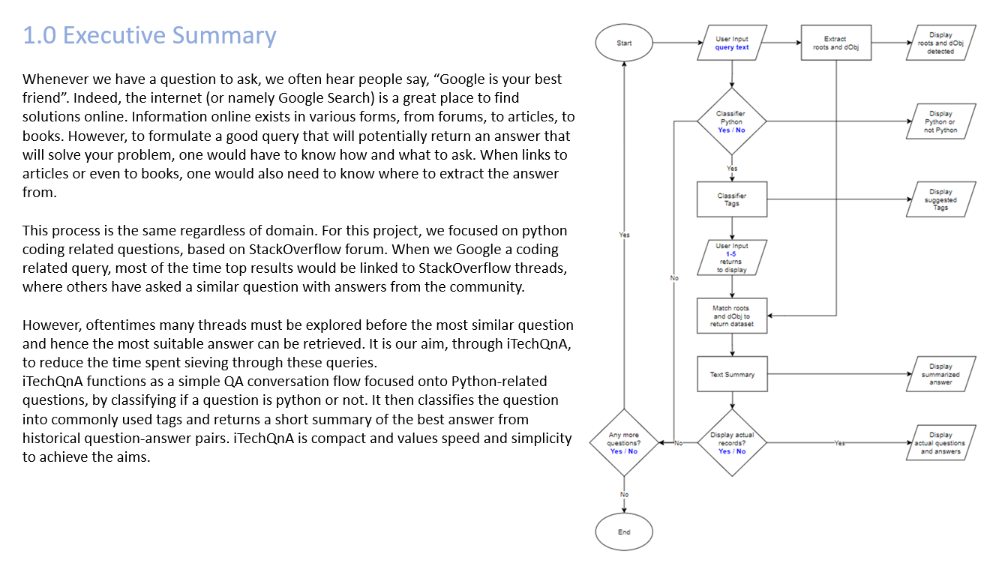

## SECTION 1 : PROJECT TITLE
## iTechQnA - A light-weighted chat flow to find answers on Python

---

## SECTION 2 : EXECUTIVE SUMMARY

---

## SECTION 3 : CREDITS / PROJECT CONTRIBUTION

| Official Full Name  | Student ID (MTech Applicable)  | Work Items (Who Did What) | Email (Optional) |
| :------------ |:---------------:| :-----| :-----|
| Lim Kah Ghi | A0100172A | from 0% to 100% | E0508022@u.nus.edu |
| Chng Yan Hao | A0024023A | from 0% to 100% | E0529228@u.nus.edu |

---

## SECTION 4 : PROMOTION & SYSTEM VIDEOS

- View [System](https://youtu.be/WmtekMTeuLs)

---

## SECTION 5 : USER GUIDE

`Refer to appendix`[QuickUserGuide](https://github.com/RyanChngYanHao/PLP-PT-CNI-2021-07-24-EBA5004-GRP-iTechQnA/blob/master/ProjectReport/QuickUserGuide.pdf) `in Github Folder: ProjectReport`

### Recommended:

---
## SECTION 6 : PROJECT REPORT / PAPER

`Refer to`[ProjectReport](https://github.com/RyanChngYanHao/PLP-PT-CNI-2021-07-24-EBA5004-GRP-iTechQnA/blob/master/ProjectReport/ISPT_Group15_PLP_PM_iTechQnA.pdf) `in Github Folder: ProjectReport`

**Recommended Sections for Project Report / Paper:**
- Executive Summary
- Approaches
- System Architecture / Conversation Flow

---
## SECTION 7 : MISCELLANEOUS

`Refer to Github Folder: Miscellaneous`

---

**Special thanks to [NUS-ISS](https://www.iss.nus.edu.sg "Institute of Systems Science, National University of Singapore") lecturers in [Practical Language Processing (PLP)](https://www.iss.nus.edu.sg/stackable-certificate-programmes/graduate-certificate/data-science/graduate-certificate-in-practical-language-processing "Practical Language Processing"), making this possible.**
